# NoCodeLogic

A Rule Builder application “No Code Logic” that empowers Business Analysts to create, save, and visualize decision strategies. Provide a no-code rule writing experience and visual representation to test these rules in real-time and observe the calculations at each step.

## What is NoCodeLogic?

NoCodeLogic is a simple, user-friendly web application that lets anyone create, manage, and test business rules **without writing any code**. It is designed especially for business analysts and other non-technical users who want to build decision-making logic visually and quickly.

---

## Why Use NoCodeLogic?

Many business processes rely on complex rules to make decisions, like approving loans, calculating discounts, or managing workflows. Usually, these rules require developers to write code, which can be slow and costly to change. NoCodeLogic puts the power in your hands, allowing you to:

- Build rules visually using an easy drag-and-drop or tree-based interface
- Use AI assistance to create rules by simply describing what you want
- Test your rules instantly with different inputs to see how they behave
- Save different versions of your rules to track changes and improve them over time

---

## Key Features

- **No-code rule creation:** Create complex decision rules visually, no programming skills needed.
- **AI-powered rule generation:** Describe your rule in plain language, and AI helps build it.
- **Real-time testing:** Input example data and see how the rule processes it step-by-step.
- **Rule versioning:** Save multiple versions of rules to safely make changes.
- **Visual rule trees:** Easily understand your logic through clear, graphical rule flowcharts.
- **Secure login:** Sign in with email or Google accounts.

---

## Who Should Use NoCodeLogic?

- Business analysts who design and manage business decisions
- Managers who want quick updates to decision logic without waiting for developers
- Developers who want to give business users more control over rules
- Any organization needing faster, transparent, and flexible decision-making tools

---

In short, **NoCodeLogic** helps you create and test business decision rules quickly and confidently — all without writing a single line of code.

#### Web Link: https://no-code-logic.vercel.app/

| Architecture                      |
| --------------------------------- |
|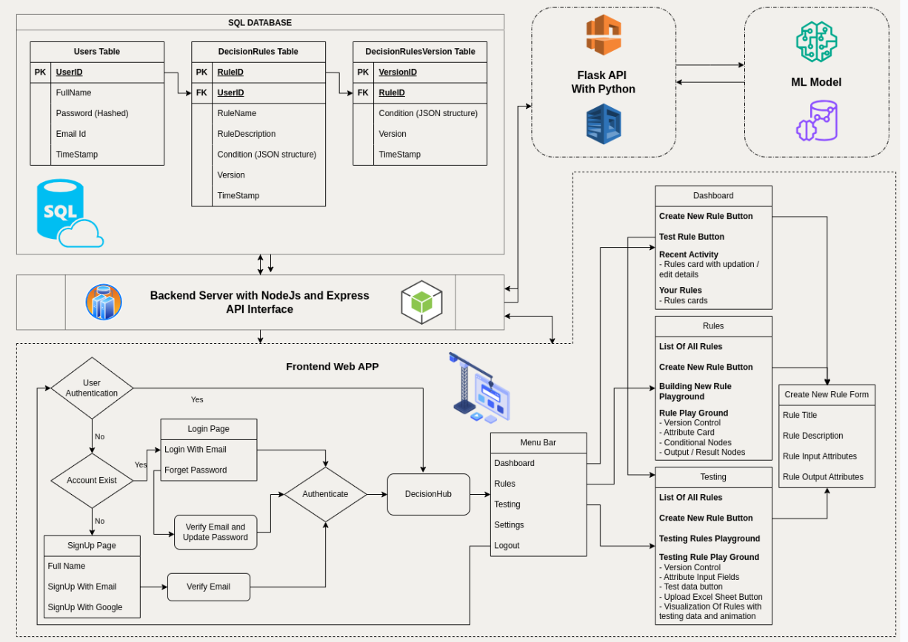|

| Signup                      |
| --------------------------------- |
|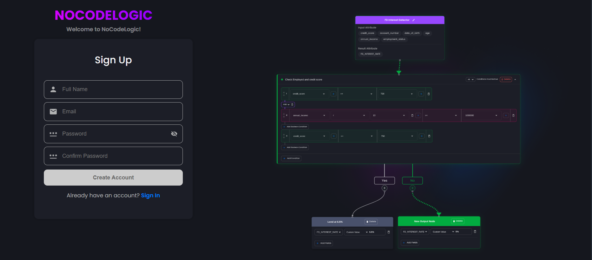|

| Landing Page                      |
| --------------------------------- |
||

| Dashboard                         |
| --------------------------------- |
| 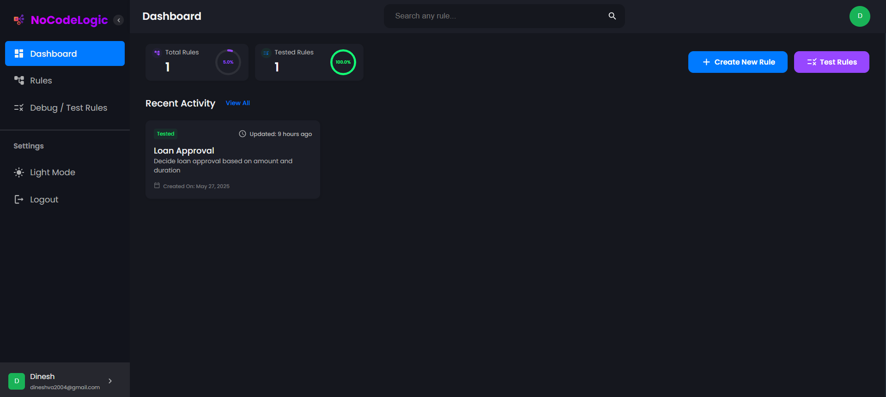 |

| Creation of Rules                          |
| ------------------------------ |
| 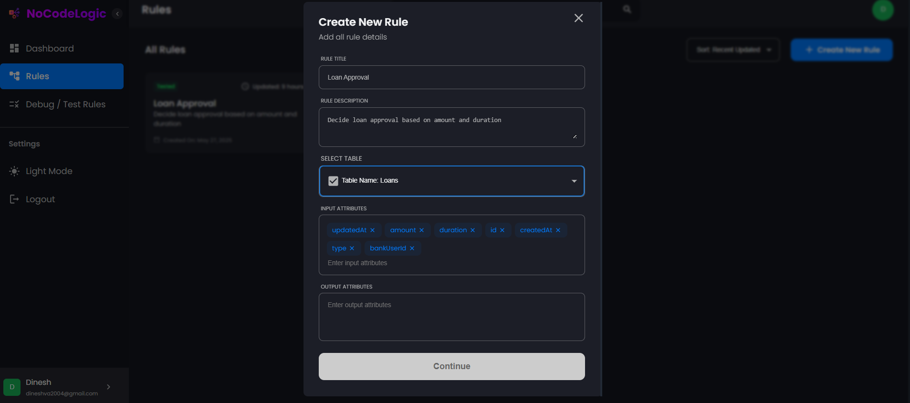 |
| 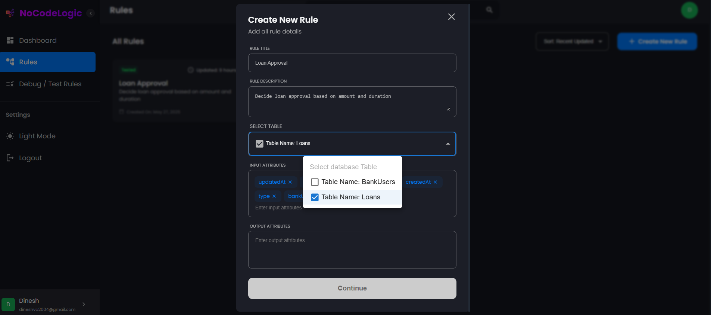 |
| 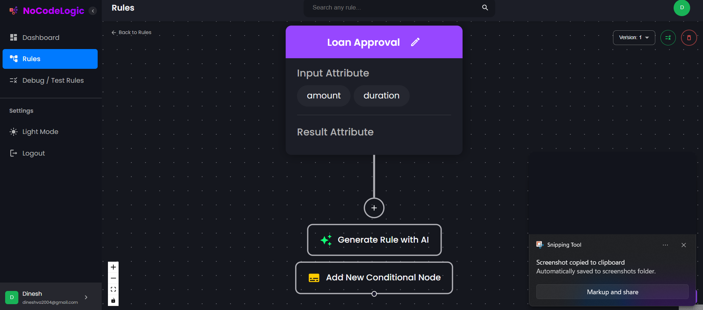  |
| 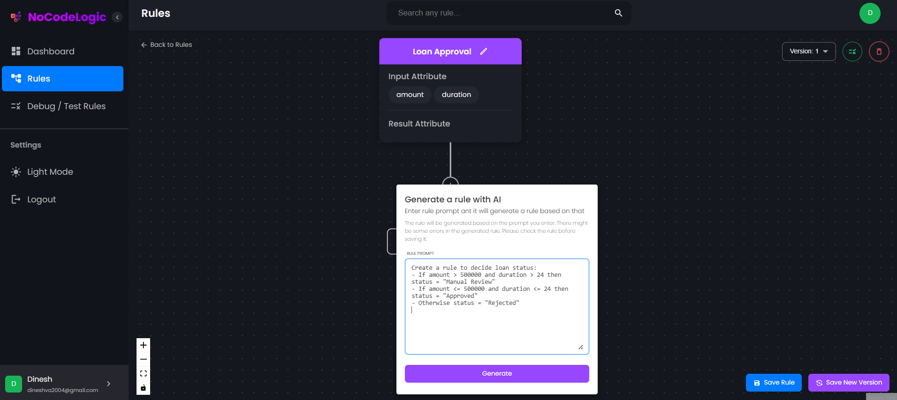  |
| 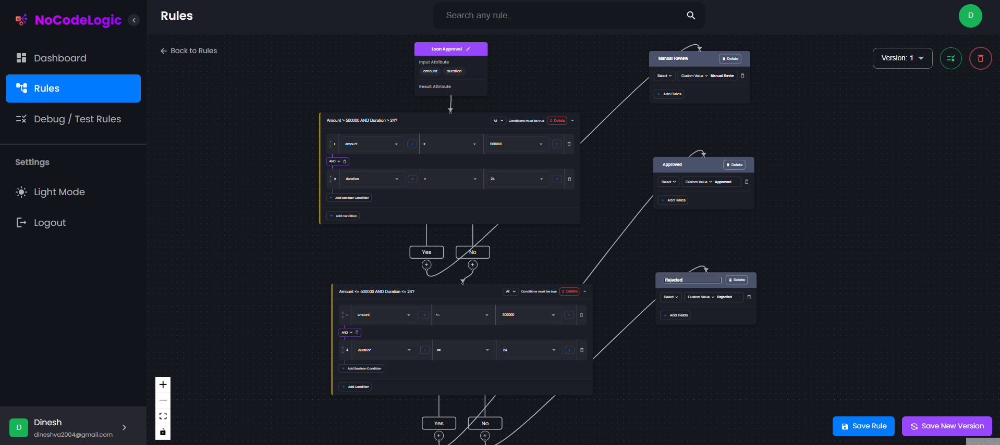 |
| 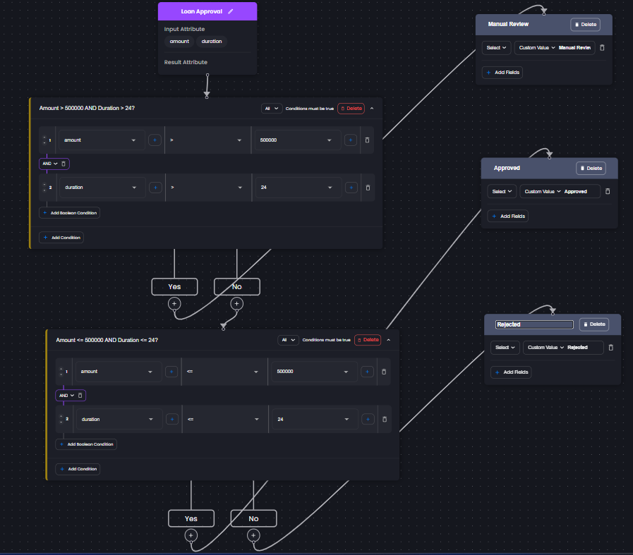  |

| Debug / Test Rules                 |
| ---------------------------------- |
| 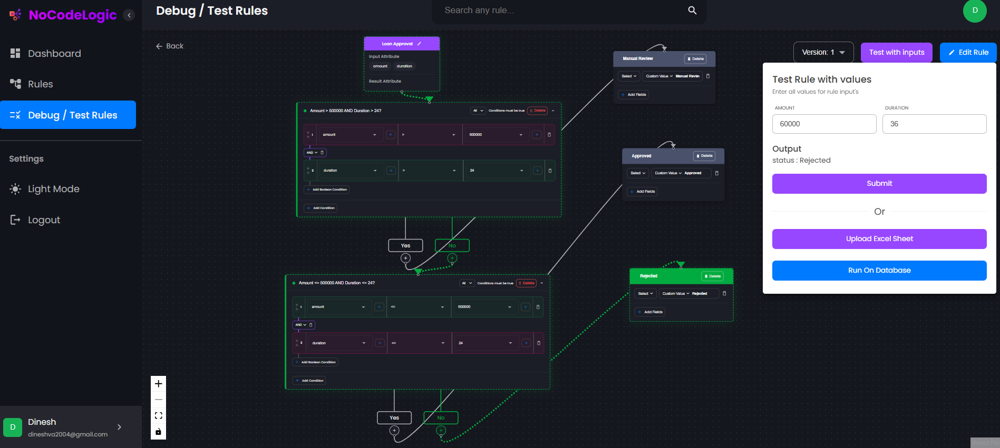   |
| 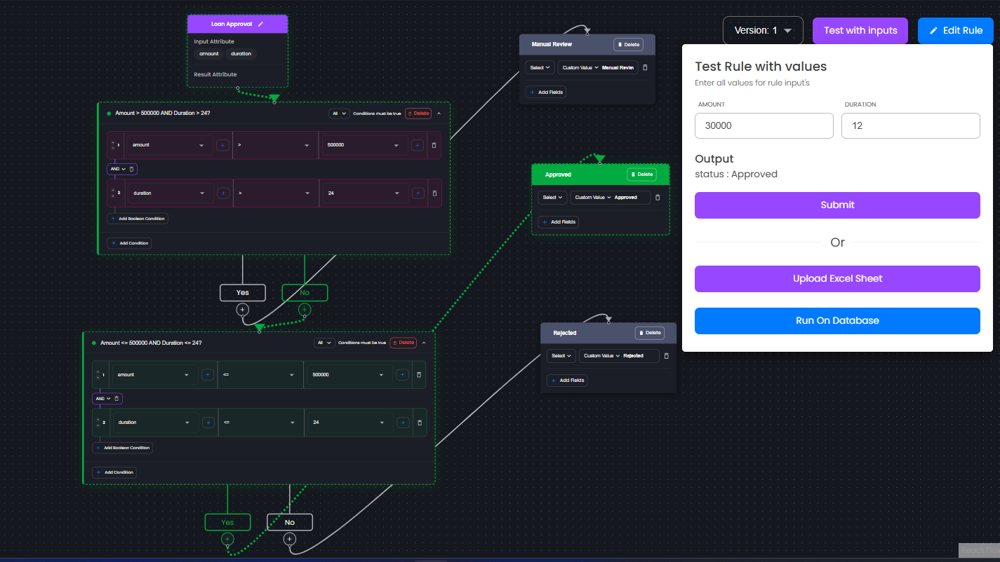  |
| 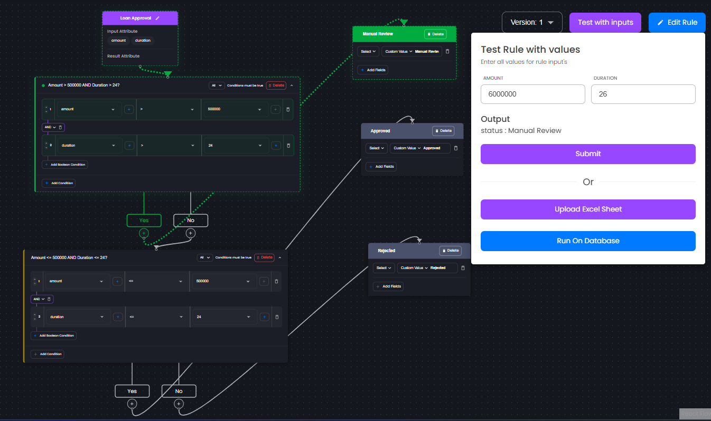  |
| 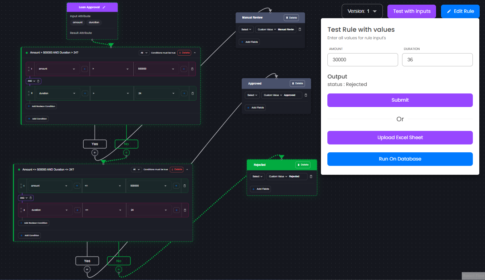  | 

## Features

- **User Authentication:**  
  - Secure login using email and password or via Google Account for quick access.

- **Rules Management:**  
  - **Add Rules:** Create rules across multiple databases, specifying rule descriptions, input attributes, and expected output attributes.  
  - **Condition Creation:** Build conditions manually or generate them automatically using AI based on natural language prompts.  
  - **Version Control:** Maintain multiple versions of each rule to track changes and revert to previous versions if needed.

- **AI Integration:**  
  - Utilize AI to generate rule conditions from user prompts, simplifying rule creation and reducing manual effort.

- **Debugging and Testing:**  
  - Test rules in real-time with custom inputs.  
  - Step through rule execution to observe intermediate calculations and verify correctness.

- **Visual Rule Builder:**  
  - Create and visualize rules using an intuitive tree-like graphical interface, making complex logic easier to understand and manage.


## Getting Started

### Pre-requisites

1. Create a [Render](https://dashboard.render.com/) account and set up a new PostgreSQL database.

### Clone the repository

1. Clone the repository: `git clone https://github.com/v-a-dinesh/NoCodeLogic.git`

### Configure the client

1. Navigate to client folder: `cd client`
2. Install required packages: `npm i`

### Configure the server

1. Navigate to server folder: `cd server`
2. Install required packages: `npm i`
3. Set up the database and configure the environment variables by following the instructions in the next steps.

### Set up the database

1. Create a Render Account and Create new PostgreSQL database
2. Create a `.env` file in the server folder and add the following environment variables:

```
PORT= <port_to_run_node_server>
DATABASE_URL= <postgres_connection_string>
JWT= <JWT_secret>
EMAIL_USERNAME= <nocodelogic_gmail_username>
EMAIL_PASSWORD= <nocodelogic_gmail_password>
OPENAI_API_KEY= <openai_api_key>
```

### Run the application

#### Run the client

1. Navigate to server folder: `cd client`
2. Start Client : `npm start`
3. Open the application in your browser at `http://localhost:3000`

#### Run the server

1. Navigate to server folder: `cd server`
2. Start Client : `npm start`
3. Server will be running at `http://localhost:8080`

## Technologies Used

### Front-End
- **React.js** — For building the user interface with reusable components  
- **Redux** — State management for predictable and centralized application state  
- **React Flow** — Visualizing and building rule trees and flowcharts  
- **HTML5 & CSS3** — Markup and styling for responsive and modern web design  
- **JavaScript (ES6+)** — Core programming language for client-side logic

### Back-End
- **Node.js** — JavaScript runtime environment for building the server  
- **Express.js** — Web framework for handling API requests and routing  
- **JWT (JSON Web Tokens)** — Secure user authentication and authorization  

### Database
- **PostgreSQL** — Relational database to store user data, rules, and versions  

### Other Tools and Services
- **Render** — Hosting platform used for deploying the application and PostgreSQL database  
- **OpenAI API / Gemini API** — AI services integrated for generating rule conditions and assisting users  
- **Google OAuth** — Enables secure login via Google accounts  
- **NPM** — Package manager for managing dependencies in both client and server projects  
- **Postman** — API testing tool for verifying API responses  
- **Git** — Version control system for managing code changes  
- **GitHub** — Platform for hosting and collaborating on code repositories


## Contributing

We welcome contributions from the community to enhance NoCodeLogic. Feel free to submit bug reports, feature requests, or pull requests through the GitHub repository.

## License

This project is licensed under the [MIT License](https://opensource.org/licenses/MIT).

## Contact

For any questions or inquiries, please reach out to the development team at [NoCodeLogic](mailto:nocodelogic@gmail.com)

Enjoy using NoCodeLogic! and stay productive!
